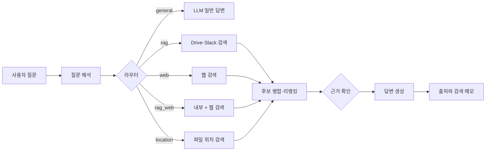

# LabRAG

LabRAG는 연구실 문서와 메신저 기록을 한곳에서 찾기 위해 만든 RAG 백엔드다. 질문을 바로 검색하지 않고 먼저 용도를 분류한 뒤, Google Drive·Slack·웹 중 필요한 출처만 조회한다. 내부 자료를 사용한 답변에는 원문 링크를 남긴다.

이 저장소는 실제 운영 코드를 공개용으로 정리한 스냅샷이다. 인증정보, 원문 데이터, 채널명, 사용자명, 사설 네트워크 설정은 포함하지 않는다. 바로 배포할 수 있는 제품보다는 코드 구조와 설계 판단을 설명하는 데 초점을 맞췄다.

## 질문이 처리되는 순서



라우터는 다음 다섯 가지 경로를 사용한다.

| 모드 | 질문 예 | 처리 |
|---|---|---|
| `general` | “초보자 운동 루틴을 알려줘” | 내부 검색 없이 생성 모델이 답한다. |
| `rag` | “지난달 프로젝트 회의 내용을 정리해줘” | Drive와 Slack 인덱스에서 근거를 찾는다. |
| `web` | “최근 스마트팜 정책을 찾아줘” | 웹 검색 결과만 사용한다. |
| `rag_web` | “내부 로봇 과제와 최근 업계 동향을 비교해줘” | 내부 자료와 웹 결과를 분리해 검색한다. |
| `location` | “Conference_2026.pdf가 어디 있어?” | 파일명·경로·Drive 실시간 검색을 합친다. |

`auto` 모드에서는 명시적인 출처, 파일 위치 표현, 내부 업무 표현, 최신 정보 표현 순으로 규칙을 적용한다. 판단이 애매한 질문은 내부 인덱스를 짧게 조회한 뒤 검색 여부를 결정한다. 구현은 [`labrag/router.py`](labrag/router.py)에 있다.

## 코드를 읽는 순서

전체를 처음부터 읽을 필요는 없다. 아래 파일을 순서대로 보면 요청 하나가 답으로 바뀌는 흐름을 파악할 수 있다.

| 순서 | 파일 | 역할 |
|---:|---|---|
| 1 | [`labrag/server.py`](labrag/server.py) | OpenAI 호환 API, 요청 정리, 라우팅과 답변 생성 연결 |
| 2 | [`labrag/router.py`](labrag/router.py) | 일반 답변·내부 검색·웹·복합·위치 검색 선택 |
| 3 | [`labrag/rag.py`](labrag/rag.py) | 검색 후보 결합, 리랭킹, 출처 균형, 프롬프트 구성 |
| 4 | [`labrag/store.py`](labrag/store.py) | Qdrant 조회와 메타데이터 기반 최신·폴더 검색 |
| 5 | [`labrag/drive_live.py`](labrag/drive_live.py) | 아직 인덱싱되지 않은 Drive 파일 실시간 보완 |
| 6 | [`labrag/slack.py`](labrag/slack.py) | Slack 수집과 스레드 단위 조각 생성 |
| 7 | [`labrag/refresh.py`](labrag/refresh.py) | Drive·Slack 증분 최신화 단계 실행과 결과 보고 |

세부 구성과 함수 사이의 데이터 흐름은 [`docs/architecture.md`](docs/architecture.md)에 정리했다.

## 검색 파이프라인

### Google Drive

1. `config/scope.json`에 지정한 폴더만 스캔한다.
2. Google 문서는 rclone이 DOCX·XLSX·PPTX로 내보낸 결과를 사용한다.
3. PDF, Office 문서, HWP, 표, 텍스트 파일을 구조에 맞춰 파싱한다.
4. 페이지와 섹션 경계를 가능한 한 유지하면서 검색 조각을 만든다.
5. 임베딩과 파일 메타데이터를 Qdrant에 저장한다.

기본 조각 크기는 1,200자이며 인접 조각 사이에 200자를 겹친다. 표 파일은 산문과 다르게 행·열 구조를 보존한다. 관련 코드는 [`labrag/chunk.py`](labrag/chunk.py), [`labrag/tabular.py`](labrag/tabular.py), [`labrag/parse.py`](labrag/parse.py)에 있다.

### Slack

Slack 메시지는 채널과 스레드 시작 시각을 기준으로 묶는다. 짧은 스레드는 하나의 검색 조각으로 유지하고, 긴 스레드는 Drive 문서와 같은 크기로 나눈다. 임베딩용 텍스트에는 채널과 스레드 맥락을 붙이지만 사용자에게 보여 주는 인용은 실제 메시지 링크를 사용한다.

채널명은 사용자가 띄어 쓰거나 일부만 말할 수 있다. [`labrag/slack_channels.py`](labrag/slack_channels.py)는 구분자를 제거한 이름과 어절 조각을 비교하되, 둘 이상의 채널에 걸리는 표현은 임의로 고르지 않는다.

### 파일 위치

위치 질문은 세 신호를 합친다.

- 인덱스의 파일명·경로 검색
- 문서 조각의 의미 검색
- Google Drive API 실시간 검색

실시간 결과는 지정된 루트 안에 있는지 다시 확인한다. 인덱스와 Drive에서 같은 파일이 나오면 파일 ID로 합치고, 생성일·수정일·파일명 일치 여부를 함께 표시한다. 구현은 [`labrag/location.py`](labrag/location.py)와 [`labrag/location_merge.py`](labrag/location_merge.py)에서 볼 수 있다.

## 설정

예제 파일을 복사한 뒤 자신의 환경에 맞게 값을 바꾼다.

```bash
cp .env.example .env
cp config/scope.example.json config/scope.json
cp config/canonical_records.example.json config/canonical_records.json
```

주요 환경변수는 다음과 같다.

| 변수 | 설명 |
|---|---|
| `LABRAG_LIVE_DRIVE_ROOT_ID` | 검색을 허용할 Google Drive 루트 폴더 |
| `SLACK_TOKEN` | Slack Web API 토큰 |
| `LABRAG_QDRANT_URL` | Qdrant 주소 |
| `LABRAG_EMBED_URL` | OpenAI 호환 임베딩 API 주소 |
| `LABRAG_RERANK_URL` | 리랭커 API 주소 |
| `LABRAG_VLLM_URL` | 답변 생성용 OpenAI 호환 API 주소 |
| `LABRAG_MODEL_ID` | Open WebUI에 표시할 모델 이름 |
| `LABRAG_TAVILY_API_KEY` | 선택 사항인 웹 검색 키 |

전체 목록과 기본값은 [`.env.example`](.env.example)과 [`labrag/config.py`](labrag/config.py)를 참고한다.

## 실행 예

이 저장소는 모델 파일과 GPU 배치를 정하지 않는다. 임베딩·리랭커·생성 API가 먼저 실행 중이라고 가정한다.

```bash
python -m pip install -r requirements.txt
python -m uvicorn labrag.server:app --host 127.0.0.1 --port 8100
```

Qdrant와 Open WebUI 예시는 Docker Compose로 실행할 수 있다.

```bash
docker compose up -d qdrant openwebui
```

기본 바인딩은 loopback이다. 다른 PC에서 접속하게 만들려면 주소를 변경하기 전에 방화벽, 로그인 정책, TLS 적용 여부를 먼저 결정해야 한다.

## 인덱싱과 최신화

```bash
python scripts/index.py
python scripts/index_slack.py
python scripts/weekly_refresh.py --check
```

주간 최신화는 모델 학습이 아니다. 새 원문을 수집하고 검색 조각과 임베딩을 갱신할 뿐, 생성 모델의 가중치는 바꾸지 않는다.

`scripts/weekly_refresh.py`는 다음 단계를 순서대로 실행한다.

1. 외부 서비스와 인증 사전 점검
2. Drive 증분 색인
3. Slack 새 메시지 수집
4. Slack 스레드 문맥 생성
5. Slack 조각과 상위 스레드 색인
6. 컬렉션 상태 검증

systemd 예제는 [`deploy/`](deploy/)에 있다. 실제 서비스로 복사하기 전에 Python 경로와 작업 디렉터리를 확인해야 한다.

## 테스트

```bash
python -m unittest discover -s tests -v
python tools/public_audit.py .
docker compose config
```

테스트는 라우팅 우선순위, Drive 위치 검색, Slack 채널 해석, 출처 분리, 웹 검색 실패 폴백, 주간 최신화 단계와 공개 설정을 다룬다. 외부 API는 테스트 중 실제로 호출하지 않는다.

## 공개본에서 제외한 것

- 실제 Google Drive와 Slack 원문
- OAuth 클라이언트 파일과 토큰
- Qdrant 저장소와 모델 캐시
- 연구실별 UI 이미지와 브랜딩
- 워크스테이션 주소와 운영 계정 정보
- 실제 평가 질문과 운영 로그

[`tools/public_audit.py`](tools/public_audit.py)는 공개하면 안 되는 문자열과 인증정보 형태를 검사한다. 운영 환경의 실제 금지 문자열 목록은 공개 저장소 밖에서 별도로 전달할 수 있다.

## 한계

- 규칙 기반 라우터이므로 새로운 표현은 테스트 사례를 추가하며 보완해야 한다.
- OCR이 없는 스캔 PDF, 이미지, 영상, 음성은 본문 검색 범위 밖이다.
- Google Drive와 Slack API 권한 범위는 연동 계정 설정에 달려 있다.
- “최근”은 검색 후보 안에서의 최신을 의미한다. 달력 범위가 중요하면 기간을 질문에 명시해야 한다.
- 공개본의 Docker Compose는 모델 서버를 포함하지 않는다.
- 이 저장소에는 라이선스 파일이 없다. 코드를 재사용하거나 배포하려면 저장소 소유자에게 별도로 확인해야 한다.

## 보안 메모

`.env`, rclone 설정, OAuth JSON, 원문 데이터, 로그와 벡터 저장소는 Git에 추가하지 않는다. 공개 전에는 Git에 추적되는 파일만 대상으로 감사 도구와 별도의 비밀정보 검사를 다시 실행하는 편이 안전하다.
